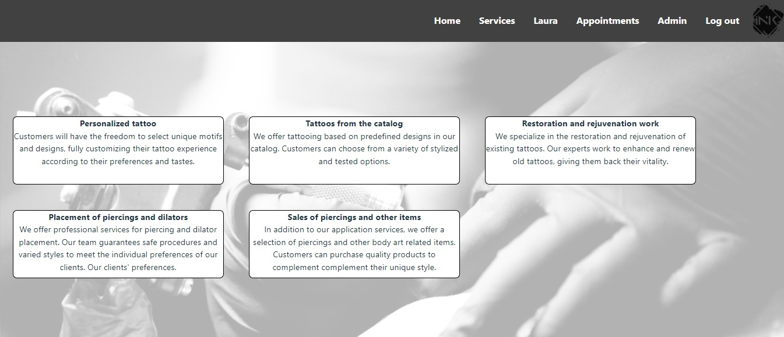
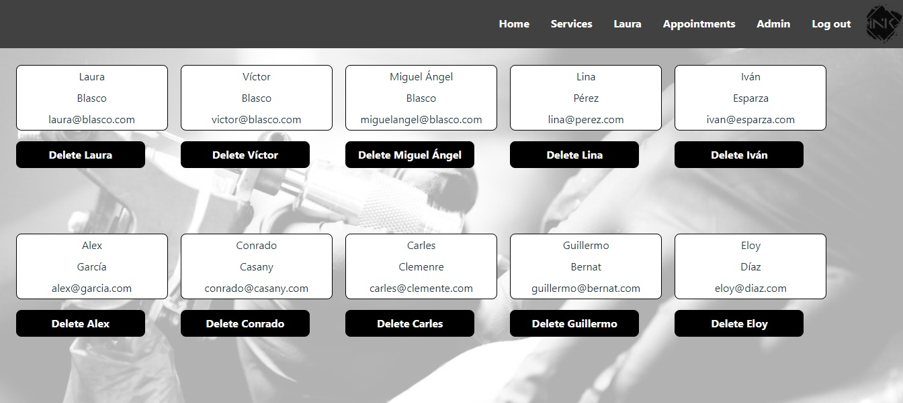

# INK-ARt
Bienvenido a la documentación de la web de mi estudio de tatuajes. Es mi sexto proyecto desarrollado en GeeksHubs Academy en el cual se ponen en práctica habilidades de desarrollo frontend con React.


## Tabla de contenido :page_with_curl:

- [Tecnologías.](#tecnologías-star2)
- [Características.](#características)
- [Instalación en local.](#instalación-en-local-gear)
- [Usuarios modelo](#usuarios-modelo-pouting_face)
- [Futuras funcionalidades.](#futuras-funcionalidades)
- [Autor.](#autor-curly_haired_man)
- [Agradecimientos.](#agradecimientos)

### Tecnologías :star2:

     


### Características	:label:
**Barra de navegación**


**7 vistas** a las cuales todo usuario tiene acceso excepto a la de Admin. Uso exclusivo para el administrador.

<details>
<summary>Home</summary> 

- Disponemos de imagenes de tatuajes realizados a clientes.


</details>


<details>
<summary>Services</summary>

- Encontramos todos nuestros servicios.



</details>


<details>
<summary>Register</summary>


</details>


<details>
<summary>Login</summary>


</details>

<details>
<summary>Profile</summary>

- Aparecerá indicado en la barra de navegación con el nombre que se registre cada usuario.


</details>


<details>
<summary> Appointments </summary>

- El usuario podrá ver sus citas pendientes.


 - Solicitar una nueva.


- Eliminarlas.


</details>


<details>

<summary> Admin </summary>

- El administrador tendrá acceso a todos los usuarios registrados y podrá eliminarlos si fuera necesario.



</details>


### Instalación en local :gear:

**1. Clonar el repositorio.**
````
$ git clone https://github.com/VictorBlasco5/Proyect-frontend-1


````
**2. Instalar las dependencias.**

````
$ npm install
````

**3. Poner en marcha el servidor.**
````
$ npm run dev
````

### Usuarios modelo :pouting_face:

#### User
````
Nombre: Carles
Apellido: Clemente
Email: carles@clemente.com
Contraseña: Aa12345
````

#### Superadmin
````
Nombre: Laura
Apellido: Blasco
Email: laura@blasco.com
Contraseña: Aa12345
````

### Futuras funcionalidades:rocket:

- Modificar usuario siendo administrador.
- Acceso a las citas de cualquier usuario siendo administrador.
- CRUD de servicios siendo administrador.

### Autor :curly_haired_man:
- **Víctor Blasco** - Project Developer.

### Agradecimientos
- Agradecimiento a GeeksHubs Academy por su implicación en mi aprendizaje.
